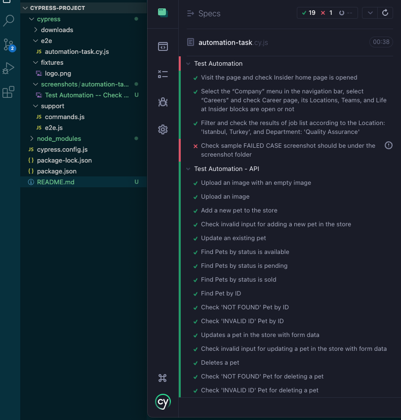

## Overview

- This repo is structured with Cypress

## Installation

```bash
## Install all the dependencies
npm install
```

## Opening Cypress App

```bash
cd ./cypress-project
# Open Cypress App
./node_modules/.bin/cypress open

Run automation-task.cy.js
```


## Running from the CLI

Same as running Cypress GUI but with `npm run test` command

```bash
# Run tests with Chrome
npm run test:chrome

# Run tests with Firefox
npm run test:firefox
```

There is an  sample FAILED case, you can find the failed test screenshot under the screenshots folder.

